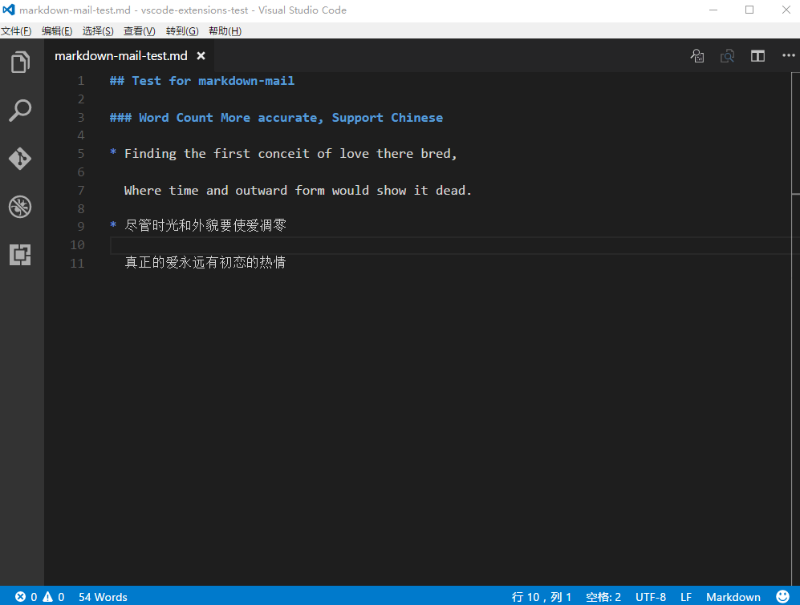
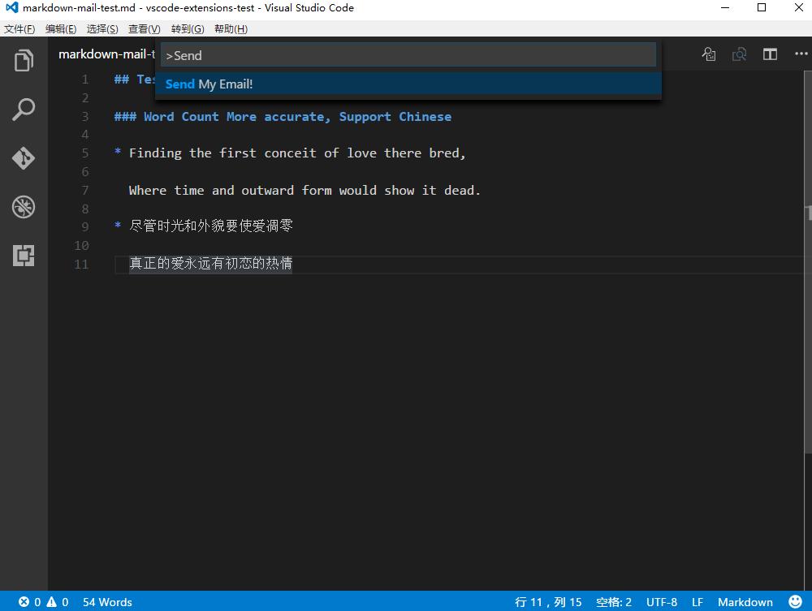
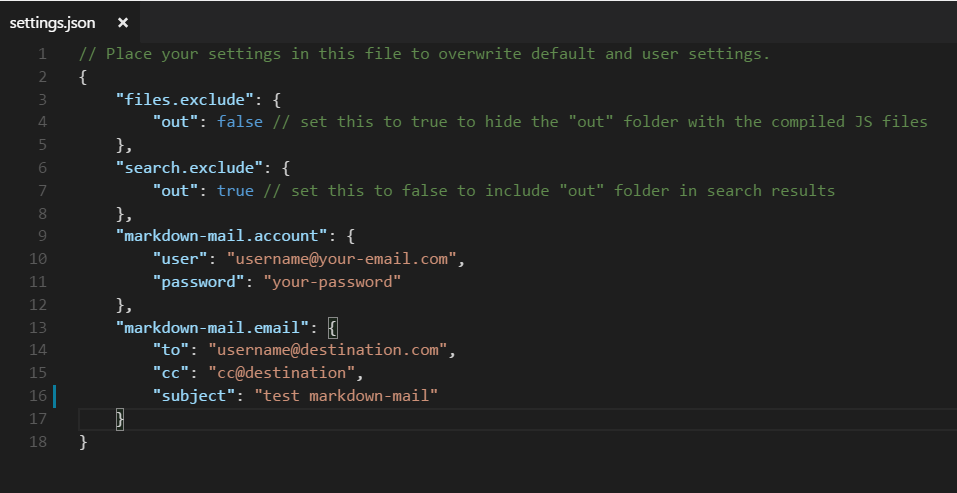

# Markdown Mail README

**Markdown Mail! Make mail Great Again!**Just write with Markdown and
type "**ctrl+shift+p**" (Mac: '**cmd+shift+p**'), which brings up the 
**Command Palette**. From here, you type "**send**" and select "**Send My Email**"
and you are good to go. A few seconds later, your email should arrive destination.

First of all.Config your email accout and email setting! [See Here](#Settings)

## Features

### WordCount
  More accurate! Support Chinese!



### Markdown and Send!
  Write your email leverage the power of markdown and send the email to your friend.



## Requirements

* You should have **a email account of which stmp service is avaliable**.

  Currently, this extension support **outlook**, **hotmail**, **gmail**, **163**, **126**
  and most importantly, **ecnu**( email service provided by my school🙇 )

* If your service (ex: gmail) uses **two-step authentication**, use an application specific password

<h2 id="Settings">Extension Settings</h2>

Open your workspace setting in '**./vscode/settings.json**' or config vscode's user setting globally



* `markdown-mail.account`: Config your email account. Such as:
```
{
  "user": "username@your-email.com",
  "password": "your password"
}
```
* `markdown-mail.email`: Everytime your want send a email, config your email first!
Sorry for this inconvenience, but I have to know whom you want to send to? what subject? And maybe cc 😀
```
{
  "to": "username@destination.com",
  "subject": "test emailjs",
  "cc": "cc@destination" // optinal
}
```
## Known Issues

Sent Email may be regarded as junk mail and rejected.

## Release Notes

### 1.0.0

Initial release. Basicly function but enough

----------------------------------------------

**Enjoy!**